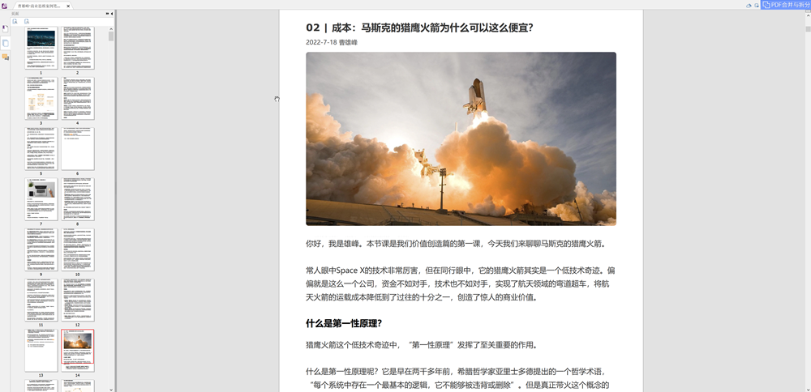

# 极客时间专栏文章自动转换为PDF

## 项目说明

因学习的习惯问题，喜欢在平板上用pdf阅读器来进行阅读，极客时间官方App并未提供pdf下载功能，逐个复制生成费时费力，因此迫切需要一个简易工具来自动化完成。在看到 [https://github.com/greyireland/geektime_to_pdf](https://github.com/greyireland/geektime_to_pdf)  这个项目后，觉得非常不错，但是原仓库长期未维护，引用的模块版本太低，所以在原基础上按自己代码习惯做了一些改进，非常感谢原作者的无私奉献，致敬！

## 技术栈

NodeJS + Python

### 注意事项

1. 在极客时间PC端登录后，复制出cookie用于自动登陆，所下载的课程必须是帐号已解锁的内容
2. 本项目仅用于学习交流，不可用于商业行为，如非法使用本项目导致的法律风险或者帐号被封，一切后果由使用者自行承担！

## 使用方法

### 配置信息

在配置文件[config.js](./config,js)中修改配置所需要的信息

```js
/**
 * 需要转换为 pdf 的配置信息 
 */
module.exports = {
    url: 'https://time.geekbang.org/serv/v1/article', // 该配置项不需要改动
    infoUrl: 'https://time.geekbang.org/serv/v3/column/info', // 该配置项不需要改动
    commentUrl: 'https://time.geekbang.org/serv/v1/comments', // 该配置项不需要改动
    columnBaseUrl: 'https://time.geekbang.org/column/article/', // 该配置项不需要改动
    firstArticalId: 0, //专栏第一篇文章的ID，可以不用填写，执行代码的时候由控制台输入即可
    columnName: '',//可不填，会自动获取
    isdownloadVideo: true, // 是否下载音频
    isComment: false, // 是否导出评论
    commentCount: 0, // 评论导出数量，最大20个
    cookie: '', //登陆后生成的cookie
};
```

### 运行

1. `git clone https://github.com/jiankeluoluo/geektime2pdf.git` 拉取代码

2. 执行 `npm i` 安装依赖

3. 编辑config.js配置，cookie必填，所下载的课程必须是cookie帐号已经解锁可以访问的课程

4. 运行主程序 `node main [初始文章ID]` 等待一段时间，生成 `PDF` 完成

5. 程序运行后，会自动生成 ./download/article、./download/json、./download/mp3、./download/pdf几个目录：

   ./download/article/课程名称：按章节生成对应的pdf，格式：序号_章节ID.pdf

   ./download/json/课程名称：整个课程所有的章节json数据

   ./download/mp3/课程名称：按章节下载的mp3音频（如果开启下载）

   ./download/pdf/讲课老师·课程名称：合并后的pdf文件

### 截图


执行过程截图



生成的PDF截图